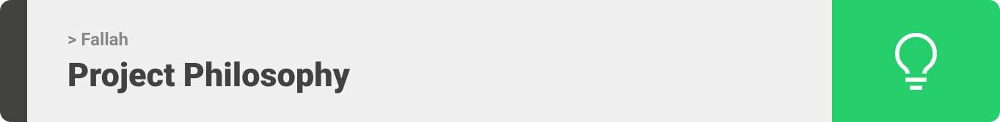
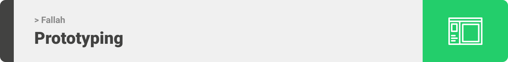
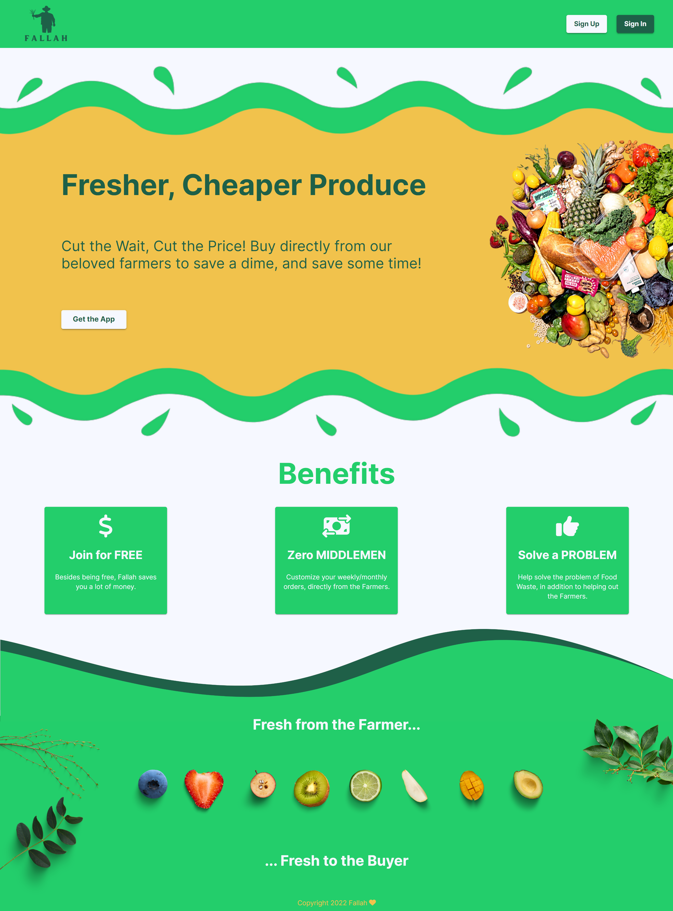

<div align="center">

> Hello world! This is the project’s summary that describes the project plain and simple, limited to the space available.

**[PROJECT PHILOSOPHY](https://github.com/YasserShkeir/Fallah/#user-content-#-project-philosophy) • [WIREFRAMES](https://github.com/YasserShkeir/Fallah/#user-content-#-wireframes) • [TECH STACK](https://github.com/YasserShkeir/Fallah/#user-content-#-tech-stack) • [IMPLEMENTATION](https://github.com/YasserShkeir/Fallah/#user-content-#-implementation) • [HOW TO RUN?](https://github.com/YasserShkeir/Fallah/#user-content-#-how-to-run)**

</div>

<br><br>




> Fallah is a mobile app made to assist Farmers in selling their produce more efficiently and with minimal loss/ food waste. Fallah was designed to be user friendly for Farmers; just snap a pic and add the details of your harvest, and you're good to go!
>
> On the other hand, shop owners. Shop owners have to physically purchase all their products, this means waking up at dawn everyday and lets face it, everyone likes sleep. Back to Fallah, shop owners will access all the products that the Farmers have uploaded, and will be able to order two types of orders, Regular Order or Scheduled Order.

### User Stories

- As a Farmer, I want to move away from my dependency on bigger corporations.
- As a Farmer, I want to move away from my dependency on bigger corporations.
- As a Shop Owner, I want access to an easier way of purchasing products.
- As a Shop Owner, I want to buy products at a cheaper price.

<br><br>




> This design was planned before on paper, then moved to Figma app for the fine details.
> Note that i didn't use any styling library or theme, all from scratch and using pure css modules

| Desktop Visitor Landing                        | Mobile Sign In Page                                |
| ---------------------------------------------- | -------------------------------------------------- |
|  |  |

<br><br>


Here's a brief high-level overview of the tech stack the Well app uses:

- This project uses [NodeJS](https://nodejs.org/en/) and [ExpressJS](https://expressjs.com/). Node.js is an open-source, cross-platform JavaScript runtime environment, and express is a fast, unopinionated, minimalist web framework for Node.js.
- For the database, [MongoDB](https://www.mongodb.com/) was used as it allows the app to run smoothly and efficiently, in addition to being able to create custom interactive Data charts for user insights.
- For the design, [ReactJS](https://reactjs.org/) and [React Native](https://reactnative.dev/) were used.
- The app uses the font ["Inter"](https://fonts.google.com/specimen/Inter?query=inter) as its main font, and the design of the app adheres to the material design guidelines.

<br><br>


> Using the above mentioned tech stacks and the wireframes built with figma from the user stories we have, the implementation of the app is shown as below, these are screenshots from the real app

### Visitor

| Visitor Desktop Landing                                      | Visitor Mobile Landing                                     |
| ------------------------------------------------------------ | ---------------------------------------------------------- |
|  |  |

### Admin

| Admin Desktop Landing Dashboard                            | Admin Desktop Users Control Section                  |
| ---------------------------------------------------------- | ---------------------------------------------------- |
|  |  |

### User

| User Sign In and Sign Up Page            |
| ---------------------------------------- |
|  |

### Buyer

| Landing Page                        | Farmer Profile                     | Adding Item to Order                |
| ----------------------------------- | ---------------------------------- | ----------------------------------- |
|  |  |  |

### Farmer

| Buyer Landing Page                               | Mobile Sign In Page                                |
| ------------------------------------------------ | -------------------------------------------------- |
|  |  |

<br><br>


> This is an example of how you may give instructions on setting up your project locally.
> To get a local copy up and running follow these simple example steps.

### Prerequisites

This is an example of how to list things you need to use the software and how to install them.

- npm
  ```sh
  npm install npm@latest -g
  ```

### Installation

Before starting with the steps below, make sure `npm` and `node` are installed globally on your machine.

1. Clone the repo
   ```sh
   git clone https://github.com/YasserShkeir/Fallah.git
   ```
2. Install NPM packages
   ```sh
   npm install
   ```
